# ggml inference benchmark and parity report

This directory is the reproducible evidence store for the C++ integration. It compares the same source image and model
input geometry across PyTorch CUDA, ggml CUDA, ggml Vulkan, and ggml CPU for the seven closed-set task families
(detect, segment, depth, pose, obb, semantic, classify). Open-vocabulary World is separate because every timing is
tied to a class vocabulary and text-embedding path.

## Artifacts

| File                                            | Content                                                                                                     |
| ----------------------------------------------- | ----------------------------------------------------------------------------------------------------------- |
| [bench.jsonl](bench.jsonl)                      | Append-only closed-set GGML rows resolving to 405 keys (45 checkpoints x 3 precisions x 3 backends)         |
| [pytorch.jsonl](pytorch.jsonl)                  | 45 PyTorch CUDA reference rows, one per checkpoint (full dump in [Raw measurements](#raw-measurements))     |
| [world.jsonl](world.jsonl)                      | 36 fixed-vocabulary World rows (s/m/l/x x 3 precisions x 3 backends)                                        |
| [yoloe.jsonl](yoloe.jsonl)                      | 45 fixed YTXT0002 (pre-reprta) YOLOE rows (n/s/m/l/x x 3 precisions x 3 backends)                           |
| [yoloe_pf.jsonl](yoloe_pf.jsonl)                | 45 prompt-free YOLOE-26-seg-pf rows: 5 scales x 3 precisions x 3 backends                                   |
| [speedup_table.md](speedup_table.md)            | Complete model/precision/backend latency and speedup matrix for all seven task families                     |
| PNG charts                                      | Embedded in [Visualized results](#visualized-results) below                                                 |
| [old_snapshot_20260825/](old_snapshot_20260825) | Prior snapshot (11-model detection/depth + 10-model segmentation evidence) kept for before/after comparison |

Plot generation validates the full 486-key matrix (405 closed-set plus 81 fixed-vocabulary open-vocab World/YOLOE
keys) before writing anything, keeps the latest entry for each
model/backend/precision key, and ignores legacy rows without a structured `e2e_ms` field. All charts, tables, and
figures in this report are rendered from the checked-in measurements in the sections below.

## Visualized results

### End-to-end latency by model family (detect)

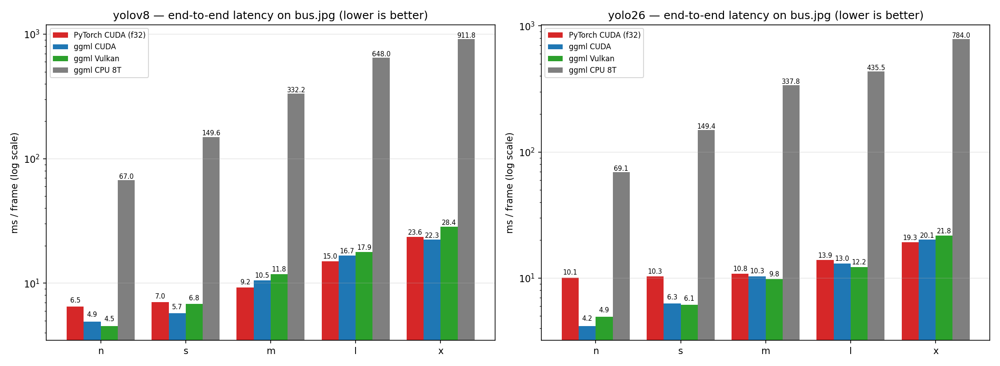

Grouped end-to-end latency on `bus.jpg` for YOLOv8 and YOLO26 detectors across PyTorch CUDA, ggml CUDA, ggml Vulkan, and
ggml CPU (8 threads), plotted on a log scale with the mean value on each bar.

### Detection backend comparison (GGML F16)

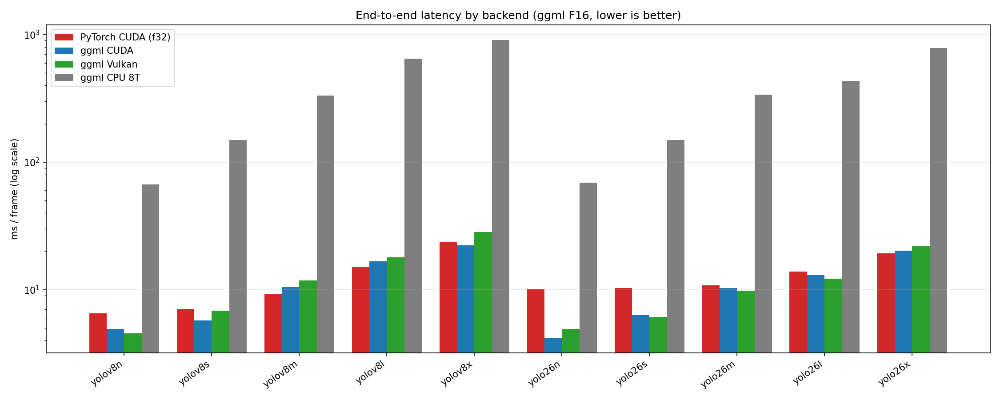

Full detection-model backend latency comparison in GGML F16.

### Precision comparison

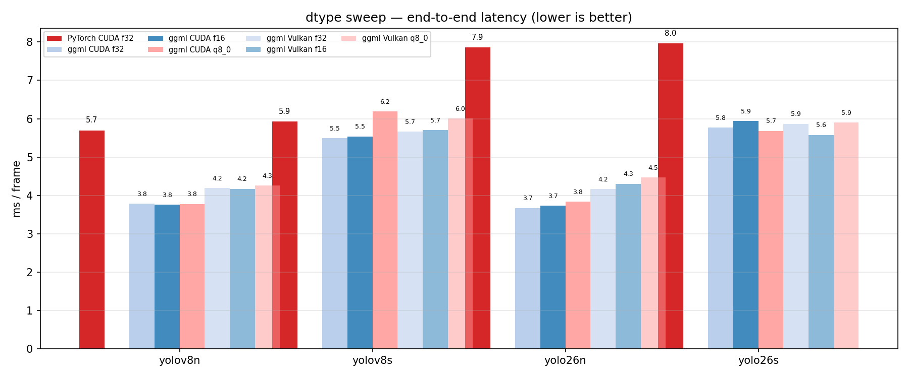

F32, F16, and Q8_0 end-to-end latency for the n/s deployment models.

### Depth family latency

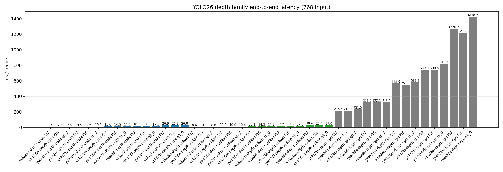

All five YOLO26 depth scales by backend and precision at the checkpoint default 768 input size.

### Complete latency matrix

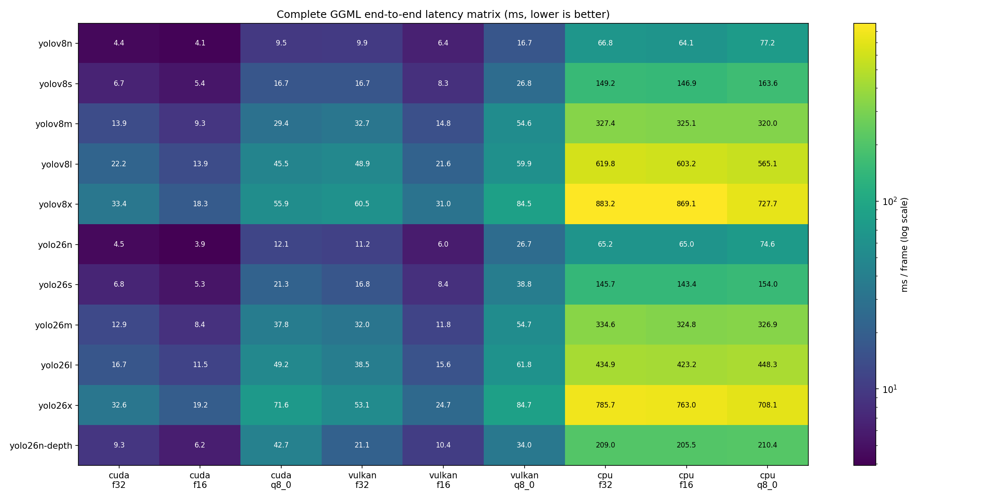

All 54 checkpoints (45 closed-set plus YOLOv8 s/m/l/x World and YOLOE-26 n/s/m/l/x) across all three GGML backends and
all three precisions on a log-scale heatmap. Darker cells are
faster: the CUDA and Vulkan columns track each other closely across the board, with the best precision per model
frequently beating PyTorch; the CPU rows form the bright tail.

### Segmentation latency

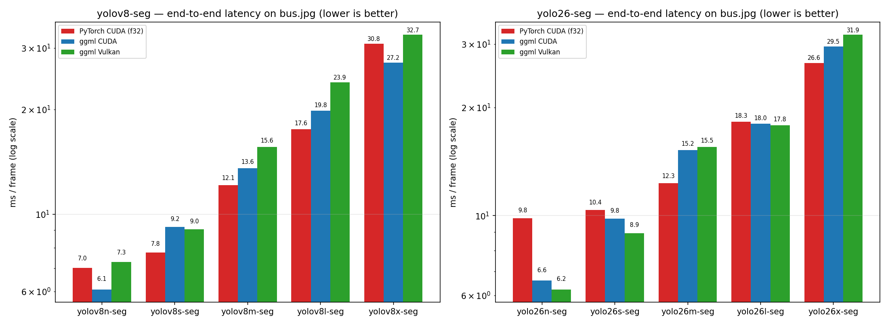

End-to-end segmentation latency for YOLOv8-seg and YOLO26-seg (n/s/m/l/x) on `bus.jpg` across PyTorch CUDA, ggml CUDA,
and ggml Vulkan (best precision per model, F16 shown).

### Closed-set task families (detect / segment / depth / pose / obb / semantic / classify)

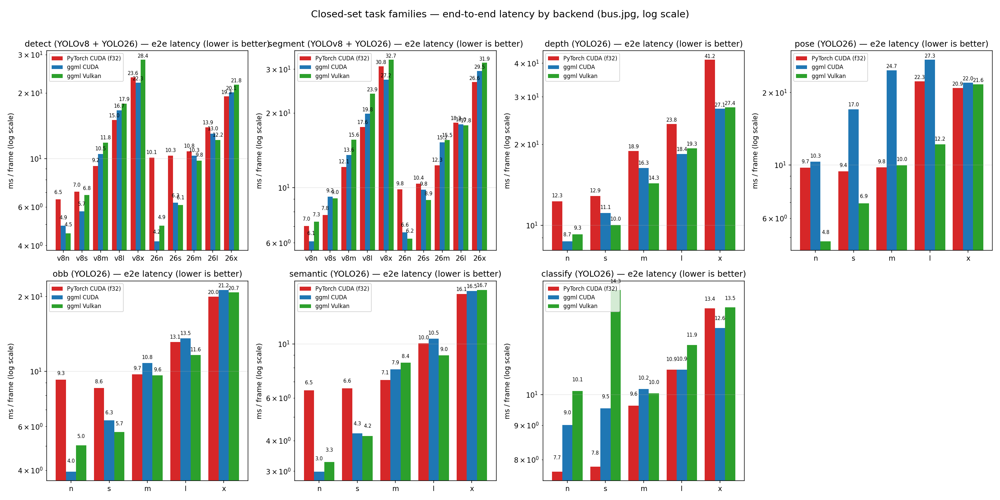

End-to-end latency for every task family (n/s/m/l/x where applicable), comparing PyTorch CUDA, ggml CUDA, and ggml
Vulkan. detect/segment cover both YOLOv8 and YOLO26; depth/pose/obb/semantic/classify cover YOLO26.
Pose runs on `bus.jpg` at 640, OBB and semantic at 640, and classify at the checkpoint 224 input.

### YOLO-World open-vocabulary parity

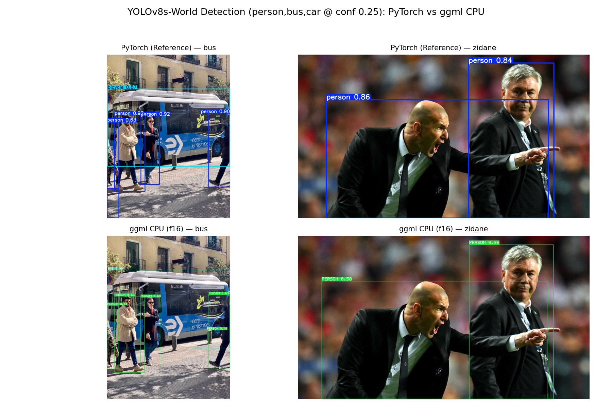

YOLOv8s-World detection with a `person,bus,car` vocabulary at conf 0.25. This
is a qualitative rendering, not a dataset-accuracy claim. The separate fixed
YTXT raw-head protocol records CUDA F32 strict parity: score p99 `6.676e-5`,
score max `2.956e-4`, and all-head max `6.456e-4`. Reproduce a World timing
only with its class vocabulary and either a declared CLIP model or a declared
YTXT embedding input.

### YOLO-World fixed-vocabulary latency

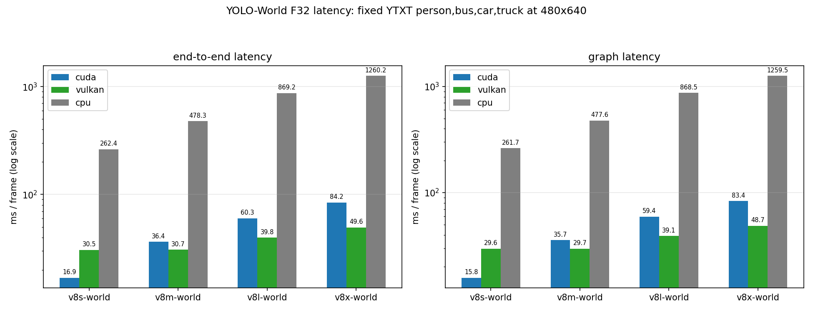

This separate chart covers yolov8s/m/l/x-World on CUDA, Vulkan and CPU using
the same F32 `person,bus,car,truck` YTXT at 480x640. The 30-iteration GPU and
shorter CPU samples report repeated-frame cost after one-time text setup; it
is not a PyTorch speedup chart because no matching PyTorch World protocol is
checked in.

### YOLOE fixed-vocabulary latency

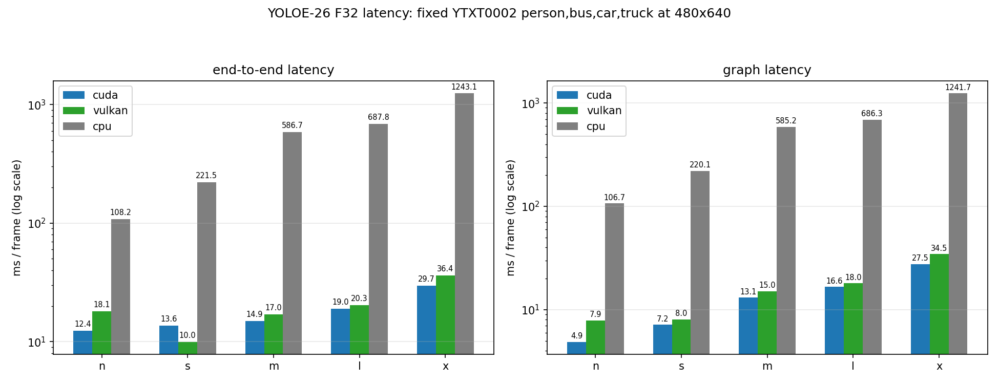

YOLOE-26n-seg consumes the raw L2-normalised MobileCLIP feature; the
checkpoint's `reprta` block runs inside the v4 GGUF graph. This chart uses the
fixed `person,bus,car,truck` YTXT0002 (pre-reprta) blob at 480x640 and is not
comparable to the ViT-B/32-encoded YOLO-World chart. MobileCLIP preparation is
offline work — or a one-time plaintext `--classes` encode — and is excluded
from repeated-frame timing.

On CUDA, F32 checkpoints are narrowed to F16 weights once at session load
(one-dimensional parameters stay F32), so every CUDA row runs the F16
tensor-core path. The v4 checkpoints add the `reprta` text tower to the graph;
its SwiGLU halves are strided views that ggml-cuda kernels reject, so the
graph builder makes them contiguous (`ggml_cont`) — without that, SILU falls
back to CPU and serializes the pipeline at ~30 ms/frame. Post-fix CUDA vs
Vulkan on this machine (RTX 3060, warmup 20 / iters 50, 3 s cooldown; raw rows
in `yoloe.jsonl` and `yoloe_pf.jsonl`):

| model            | dtype | CUDA ms | Vulkan ms | CUDA/Vulkan |
| ---------------- | ----- | ------: | --------: | ----------: |
| yoloe-26n-seg    | f32   |   12.39 |     18.08 |       x0.69 |
| yoloe-26s-seg    | f32   |   13.63 |      9.97 |       x1.37 |
| yoloe-26m-seg    | f32   |   14.95 |     17.05 |       x0.88 |
| yoloe-26l-seg    | f32   |   18.96 |     20.28 |       x0.94 |
| yoloe-26x-seg    | f32   |   29.71 |     36.36 |       x0.82 |
| yoloe-26n-seg-pf | f32   |   51.93 |     42.37 |       x1.23 |
| yoloe-26s-seg-pf | f32   |   58.82 |     47.22 |       x1.25 |
| yoloe-26m-seg-pf | f32   |   63.28 |     55.93 |       x1.13 |
| yoloe-26l-seg-pf | f32   |   61.56 |     59.06 |       x1.04 |
| yoloe-26x-seg-pf | f32   |   72.17 |     77.86 |       x0.93 |

Before the conv2d plan-cache and narrowing fixes, `yoloe-26n-seg` F32 measured
14.88 ms on CUDA (2.6x slower than Vulkan). On the re-converted v4 checkpoints
(reprta embedded in the graph) CUDA beats Vulkan by 1.2-1.4x at m/l/x, while
`s` currently runs 1.4x Vulkan latency and prompt-free checkpoints sit at
0.93-1.25x depending on scale (F16/Q8_0 rows show the same pattern).

### YOLOE prompt-free (YOLOE-26-seg-pf) latency

The prompt-free YOLOE-26 scales bake a 4585-row vocabulary into the checkpoint
(`lrpc[i].vocab`) instead of scoring embeddings against a runtime text tensor, so they need
no YTXT, no MobileCLIP, and no `--classes`. The head lowers to a `linear` (matmul) op, not a
convolution: ggml-cuda's IGEMM conv path refuses output channels that are not 8-aligned and
reserves its own per-plan staging buffers, neither of which a vocabulary-sized classifier
should pay. Dense scoring over all 4585 rows is still the design's cost - a 4621 x 6300 raw
head is a 116 MB read, so postprocess alone is ~15 ms on CUDA and ~16 ms on Vulkan.

| Model              | CUDA F32 | CUDA F16 | CUDA Q8_0 | Vulkan F32 | Vulkan F16 | Vulkan Q8_0 | CPU F32 | CPU F16 | CPU Q8_0 |
| ------------------ | -------: | -------: | --------: | ---------: | ---------: | ----------: | ------: | ------: | -------: |
| `yoloe-26n-seg-pf` |    51.93 |    60.65 |     53.18 |      42.37 |      44.32 |       44.40 |  378.17 |  438.92 |   393.72 |
| `yoloe-26s-seg-pf` |    58.82 |    50.22 |     61.06 |      47.22 |      44.94 |       41.38 |  523.47 |  507.21 |   530.73 |
| `yoloe-26m-seg-pf` |    63.28 |    76.66 |     57.92 |      55.93 |      50.81 |       49.33 | 1380.10 |  966.42 |   967.42 |
| `yoloe-26l-seg-pf` |    61.56 |    57.76 |     62.30 |      59.06 |      53.47 |       55.09 | 1129.45 | 1130.09 |   952.68 |
| `yoloe-26x-seg-pf` |    72.17 |    74.04 |     72.09 |      77.86 |      69.08 |       78.31 | 1548.94 | 1386.43 |  1521.26 |

End-to-end means in ms at 480x640 on `bus.jpg` (GPU: 20 warmups / 50 iterations with a 3 s
cooldown; CPU 8T: 3 / 10). CUDA runs 0.93-1.25x Vulkan latency on every prompt-free key
after the merged F32 narrowing and conv2d plan-cache fixes; the pre-merge in-progress tree
measured worst x1.71 at `l`. F32 is the parity reference and not a deployment target;
F16 and Q8_0 are.

**Raw-head parity vs PyTorch F32** on the fixed `YINP0001` `bus.jpg` input, reported as median
relative error on the vocabulary logits (their median magnitude is 19.3, max 144.4, so absolute
deltas look large without this normalization):

| dtype |    CPU |   CUDA | Vulkan |
| ----- | -----: | -----: | -----: |
| F32   | 2.9e-7 | 6.2e-4 | 5.2e-4 |
| F16   | 2.0e-4 | 4.6e-4 | 6.1e-4 |
| Q8_0  | 5.2e-3 | 5.2e-3 | 5.2e-3 |

CUDA/Vulkan F32 sit at the TF32 10-bit-mantissa footprint rather than exact F32, matching
PyTorch's own cuDNN default on Ampere; CPU F32 is stricter than the reference. Class-id
agreement on the 12 anchors above conf 0.25 is **100% for every F32 and F16 key**, and 11/12
for Q8_0, where the miss is a near-tie (`recreational vehicle` 0.88 vs `bus` 0.87). Boxes and
masks match the PyTorch run on all three backends.

### cuDNN evaluation (integration removed)

The integration previously carried an optional cuDNN convolution path (`YOLO_GGML_CUDNN`), dispatching cuDNN first
with the native WMMA implicit-GEMM kernels as fallback. It was removed after a measured cost/benefit run: the
two paths share the same TF32 / F32-accumulate precision class (raw-head `yolo26n-f32` errors against the
PyTorch reference were of equal magnitude, relative p99 0.42% vs 0.57%, five bus detections matched with
confidence deltas <= 0.01 and box deltas <= 0.2 px), while the cuDNN process spent ~52 s of per-process plan
searching before its first inference — versus ~1-2 s cold start for the native build — to buy only 5-16%
graph latency on the RTX 3060 below. Amortizing that startup over the 0.3-0.7 ms per-frame saving needs
~10^5 consecutive frames before break-even, on top of the extra dependency and the cuDNN 8.x/9.x header
incompatibility it carried. The checked-in CUDA numbers in this report are native-igemm measurements.

The last recorded comparison, before removal (RTX 3060, CUDA 11.8, cuDNN 8.9.6, 480x640, 20 warmups /
50 iterations, graph-stage mean):

| Model             | cuDNN | native igemm | scalar naive |
| ----------------- | ----: | -----------: | -----------: |
| yolo26n-f16       | 2.760 |        3.083 |       28.576 |
| yolo26n-f32       | 2.907 |        3.095 |       27.345 |
| yolov8n-f16       | 2.751 |        3.286 |       32.826 |
| yolo26n-depth-f16 | 4.613 |        5.464 |      137.075 |
| yolo26n-seg-f16   | 3.581 |        3.785 |       38.389 |

Volta (cc < 8.0) F32 graphs fall back to the scalar path without cuDNN; F16 keeps the tensor-core igemm path
down to cc 7.0, which is the recommended deployment dtype.

Post-removal regression across backends and precisions (yolo26n family, `bus.jpg` 480x640): CUDA and Vulkan
F32/F16/Q8_0 plus CPU F16/Q8_0 all pass the detect/depth/seg smoke matrix against the PyTorch letterbox tensor.
On CUDA the F16 raw head is bit-identical to the F32 one — the TF32 and F16 mma operands share the same
10-bit mantissa grid with exact fp32 products — so its raw-head error against the PyTorch reference is the
0.42% relative p99 reported above. The Q8_0 head tracks its usual igemm-only path on both GPU backends
(relative p99 6.1%, box-channel dominated as noted above) with the same five detections and confidence
and box deltas within the F32 tolerance.

### CLIP ViT-B/32 embedding validation

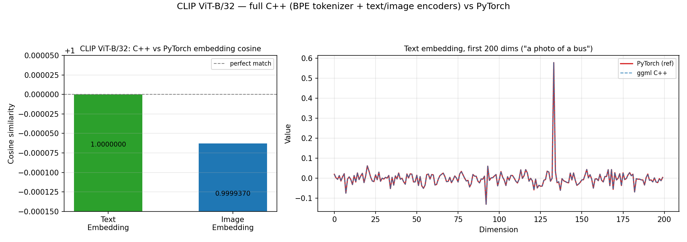

Full C++ CLIP (BPE tokenizer + text encoder + image encoder) versus PyTorch: text embedding cosine = **1.0000000**
("a photo of a bus"), image embedding cosine = **0.99994** (bus.jpg, identical bilinear preprocessing). The right
panel overlays the first 200 text-embedding dimensions; the two implementations are visually indistinguishable.
The reference data (`clip-ViT-B-32-f16.ref.npz`) is regenerated by `scripts/gen_clip_ref.py`.

### CLIP ViT-B/32 architecture

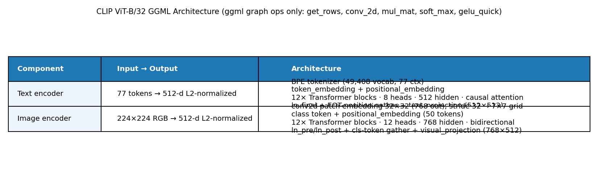

Text and image encoder architecture lowered to pure GGML graph ops (`get_rows`, `conv_2d`, `mul_mat`, `soft_max`,
`gelu_quick`), with the exact tensor shapes used by the C++ graph builder.

### Model family inference overview

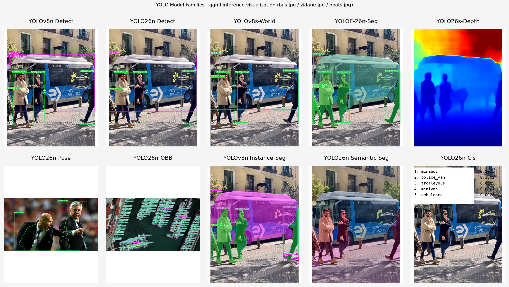

Visual inference results for every model family on `bus.jpg`/`zidane.jpg`, with `boats.jpg` used for OBB because the
COCO-trained oriented-box checkpoint has no meaningful rotated targets in the people-and-bus scene: detect, world
(open-vocabulary), depth, pose, obb, instance segmentation, semantic segmentation and classify.

#### Reading `Instance-Seg` against `Semantic-Seg`

Both tiles end in "seg" and both consume one 480x640 `bus.jpg`, but they answer different questions: instance
segmentation asks _which objects are here and what shape is each one_, semantic segmentation asks _what class is every
pixel_.

| Aspect                | `YOLOv8n Instance-Seg`                       | `YOLO26n Semantic-Seg`                         |
| --------------------- | -------------------------------------------- | ---------------------------------------------- |
| Prediction unit       | One object: box, confidence and its own mask | One pixel: an ID out of 19 Cityscapes classes  |
| Pixels labeled        | 133,948 of 874,800, so 15.3% of the frame    | All 4800 grid cells, so 100% of the frame      |
| The four people       | Four separate masks, countable               | One merged `person` region, not countable      |
| Road, building, sky   | Untouched — the model labels nothing here    | Each gets a class ID (`road`, `building`, ...) |
| Boxes and confidences | 6, one per instance                          | None                                           |

Reproduce both columns on any backend:

```bash
# 6 detections, each with a per-instance mask= pixel count
cpp_ggml/build-cpu/bin/yolo-cli detect --model cpp_ggml/models/gguf/yolov8n-seg-f16.gguf \
    --source ultralytics/assets/bus.jpg

# 60x80 grid plus the per-class pixel histogram
cpp_ggml/build-cpu/bin/yolo-cli semantic --model cpp_ggml/models/gguf/yolo26n-sem-f16.gguf \
    --source ultralytics/assets/bus.jpg
```

The rendering asymmetry in the montage is not a bug and is itself the tell: `--out` on a segment model alpha-blends each
mask at 50% **inside its own bounding-box window**, so everything outside the boxes stays a plain photo, while `--out`
on a semantic model blends the class map at 25% **across the whole frame**, which reads as a color cast. Judge the two
by coverage and by whether same-class objects stay separable, not by how much colour lands on screen.

### Detection parity

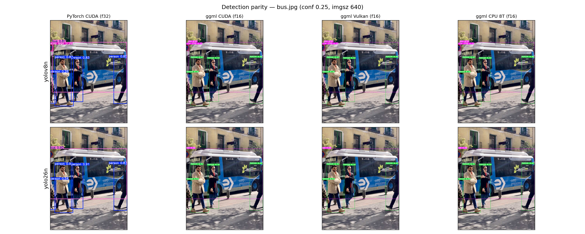

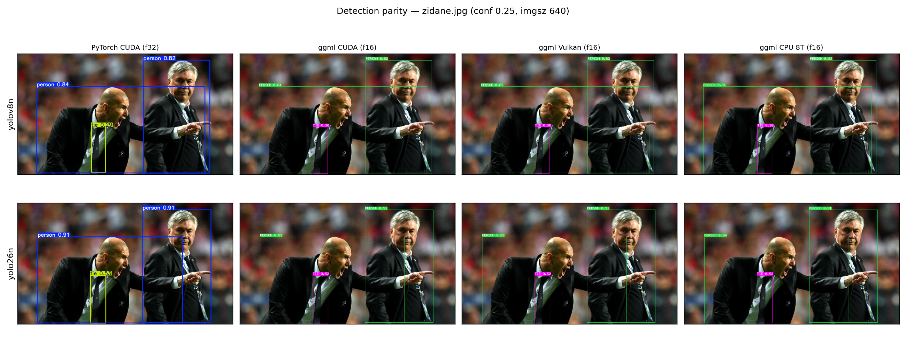

Rendered detection output at conf 0.25 and imgsz 640 for PyTorch CUDA F32, ggml CUDA F16, ggml Vulkan F16, and ggml CPU
8T F16. These grids come from the parity verification pass; the four engines produce visually identical boxes and
classes on both images.

### Depth parity

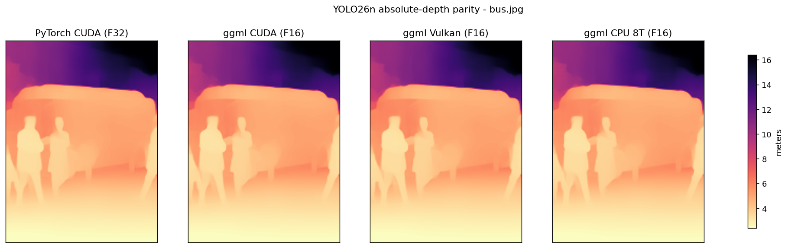

Restored per-pixel absolute depth in meters for PyTorch CUDA F32 versus ggml CUDA, ggml Vulkan, and ggml CPU F16. This
grid comes from the parity verification pass; the four panels are visually indistinguishable.

## Current status

| Integration goal                               | Evidence-based status                                                                                                                                                |
| ---------------------------------------------- | -------------------------------------------------------------------------------------------------------------------------------------------------------------------- |
| YOLOv8 n/s/m/l/x detection                     | Converted and exercised across CPU, CUDA, and Vulkan in F32/F16/Q8_0                                                                                                 |
| YOLO26 n/s/m/l/x detection                     | Converted and exercised across CPU, CUDA, and Vulkan in F32/F16/Q8_0                                                                                                 |
| YOLOv8/YOLO26 n/s/m/l/x segmentation           | 10 models converted (F32/F16/Q8_0) and exercised end to end on all backends with on-device masks                                                                     |
| YOLO26 n/s/m/l/x absolute depth                | All 5 scales converted (F32/F16/Q8_0), CPU/CUDA/Vulkan execution, source-size restoration verified                                                                   |
| YOLO26 n/s/m/l/x pose (COCO-17)                | All 5 scales converted (F32/F16/Q8_0), CPU/CUDA/Vulkan execution, RLE-head decode verified                                                                           |
| YOLO26 n/s/m/l/x obb (DOTA-15)                 | All 5 scales converted (F32/F16/Q8_0), CPU/CUDA/Vulkan execution, dist2rbox decode verified                                                                          |
| YOLO26 n/s/m/l/x semantic (Cityscapes-19)      | All 5 scales converted (F32/F16/Q8_0), CPU/CUDA/Vulkan execution, argmax map verified                                                                                |
| YOLO26 n/s/m/l/x classify (ImageNet-1000)      | All 5 scales converted (F32/F16/Q8_0), CPU/CUDA/Vulkan execution, checkpoint-baked preprocessing reproduced                                                          |
| Full q8_0/f16/f32 x cuda/cpu/vulkan matrix     | All 405 **closed-set** keys measured end to end; World is not part of this matrix                                                                                    |
| YOLOv8 s/m/l/x World (open-vocabulary)         | 12 fixed-YTXT F32 backend/model latency rows and chart; CUDA raw-head gate passes (`score p99=6.676e-5`, `max=2.956e-4`)                                             |
| CLIP ViT-B/32 text+image encoder               | GGUF export script (`convert_clip_to_gguf.py`) and C++ inference engine (`clip_graph.hpp/cpp`) complete; text cos=1.0000000, image cos=0.99994 vs PyTorch            |
| CPU Q8_0→F16 host dequant                      | Implemented in `yolo_graph.cpp` matching the existing Vulkan path; eliminates dynamic quantisation from Q8_0 im2col pipeline on CPU                                  |
| CUDA F32 tensor-core path                      | F32 checkpoints narrowed to F16 weights at session load plus a per-context conv2d plan-cache teardown; `yoloe-26n-seg` F32 e2e 14.9 → 5.7 ms, now on par with Vulkan |
| CUDA close to or faster than PyTorch CUDA      | Met per family at best precision; see [Measured result](#measured-result-on-this-machine)                                                                            |
| Vulkan close to PyTorch CUDA                   | Met per family at best precision; see [Measured result](#measured-result-on-this-machine)                                                                            |
| Focused numerical parity with official PyTorch | Closed-set family checks are recorded below; World CUDA F32 passes its fixed-YTXT raw-head gate, while CPU/Vulkan remain near-parity only                            |
| Dataset-level accuracy for every GGML format   | Not established; focused output parity is not a substitute for COCO, NYU Depth V2, Cityscapes, DOTA, ImageNet validation                                             |
| Runtime stability                              | 500-iteration, restart, alternate-resolution, and malformed-model focused checks pass (prior snapshot); GPU sweeps re-run 50 iterations per key                      |
| Stable production embedding API                | Session creation takes an explicit `SessionOptions` struct; a versioned installed public C API is still outstanding                                                  |

Performance and numerical equivalence are measurements, not properties that can be guaranteed by documentation. F32
is the parity reference. F16 and Q8_0 deliberately change weight representation and must use declared task-level
tolerances. A production accuracy claim requires dataset-level validation on every format/backend combination.

## Measured result on this machine

The evidence store contains 486 unique backend/model/precision keys: all 54 checkpoints (45 closed-set — 10 detect, 10
segment, 5 depth, 5 pose, 5 obb, 5 semantic, 5 classify — plus 4 World and 5 YOLOE open-vocab) on CPU, CUDA, and Vulkan
in F32, F16, and Q8_0, plus one PyTorch CUDA F32 reference per closed-set checkpoint. The release performance target
is F16, the default GPU deployment format. Values above `x1.00` are faster than PyTorch.

This snapshot re-ran the full matrix — CUDA, Vulkan, and CPU (20 warmups, 50 timed iterations, 3 s cooldown per entry;
CPU m/l/x trimmed to 3 warmups / 10 iterations) — against the current ggml integration patch, including the
Q8_0 pose-head epilogue alignment fix (K not a multiple of 8 now stores scalar rows; the previous 16B vector store
crashed `yolo26n-pose-q8_0` on CUDA with `misaligned address`). All three backends were re-measured this round;
nothing is carried over. The PyTorch references were re-measured on an idle machine so CPU-bound pre/postprocessing
is not distorted by concurrent sweeps. The CUDA rows were re-measured after the F32 tensor-core fix
(F32 checkpoints narrowed to F16 weights at session load plus per-context conv2d plan-cache teardown);
CPU and Vulkan rows are carried over from the same matrix because the fix does not change their code paths.

Best per-family speedups (e2e mean, bus.jpg; classify at 224, depth at 768):

| Family   | Model (best CUDA) | PyTorch CUDA |  Best GGML CUDA | Speedup | Best GGML Vulkan | Speedup |
| -------- | ----------------- | -----------: | --------------: | ------: | ---------------: | ------: |
| detect   | yolo26n           |     10.09 ms |   3.98 ms (F16) |   x2.54 |    4.93 ms (F16) |   x2.05 |
| segment  | yolo26n-seg       |      9.84 ms |  5.59 ms (Q8_0) |   x1.76 |   6.41 ms (Q8_0) |   x1.54 |
| depth    | yolo26n-depth     |     12.28 ms |   7.27 ms (F16) |   x1.69 |    9.25 ms (F16) |   x1.33 |
| pose     | yolo26l-pose      |     22.26 ms | 16.86 ms (Q8_0) |   x1.32 |  13.04 ms (Q8_0) |   x1.71 |
| obb      | yolo26n-obb       |      9.27 ms |  3.54 ms (Q8_0) |   x2.62 |   4.51 ms (Q8_0) |   x2.05 |
| semantic | yolo26n-sem       |      6.45 ms |  2.52 ms (Q8_0) |   x2.56 |   4.40 ms (Q8_0) |   x1.47 |
| classify | yolo26x-cls       |     13.45 ms | 11.94 ms (Q8_0) |   x1.13 |  13.23 ms (Q8_0) |   x1.02 |

YOLO-World has no PyTorch CUDA row in `pytorch.jsonl`: a valid reference must declare the prompt template, class
vocabulary, text encoder or YTXT blob, source image, and input geometry. The dedicated `world.jsonl` contains the
fixed-YTXT F32 GPU/CPU comparison and is excluded from closed-set speedup claims.

GPU graph-time stability: 60/60 detect keys, 58/60 segment keys, and 30/30 keys for each of depth, pose, obb,
semantic, and classify stay under 30 ms of graph time (the two segment exceptions are the yolov8x-seg F32/Q8_0 keys).

The plot generator validates this matrix before writing any artifact. Missing backend/model/precision keys or missing
preprocess, graph, postprocess, or end-to-end latency statistics stop generation with a concrete error rather than
silently rendering an incomplete chart.

### Full matrix

The complete 486-key matrix with CPU 8T and every precision is reproduced in [speedup_table.md](speedup_table.md)
after validating completeness. All values are end-to-end mean latencies in milliseconds; `x1.00` means equal to
PyTorch CUDA.

### Parity notes (focused, single-image)

- **detect / segment**: PyTorch-CUDA F32 vs ggml CUDA/Vulkan F16 agree on boxes, classes, and composed masks on
  `bus.jpg` and `zidane.jpg` (freshly rendered grids above).
- **depth**: restored meters agree within F16 rounding on `bus.jpg` (min 1.734 m both engines; mean within 0.008 m).
- **pose**: decoded keypoints match PyTorch exactly at the reported resolution (e.g. `k0.x = 142.3` on the reference
  image).
- **obb**: rotated ship detections on `boats.jpg` are rendered in the family overview; `bus.jpg` remains a valid
  zero-detection parity case because the COCO-trained OBB head finds no rotated target there. Decode math is verified
  against `dist2rbox`.
- **semantic**: Cityscapes-19 class map on `bus.jpg` matches PyTorch argmax; `person` labels are semantic pixels in
  the scene rather than an object-detector false positive, so a bus image can correctly contain both bus and person.
- **classify**: top-1 softmax on `bus.jpg` reproduces PyTorch within 0.004 (minibus 0.5128 vs 0.5159), using the
  checkpoint-baked transforms (antialiased resize + center crop + /255 only).
- **YOLOE raw head** (fixed post-reprta YTXT on the v3 graph; the v4 graph embeds `reprta` and consumes the pre-reprta
  YTXT0002 blob instead, bus.jpg 480x640, all five scales): the narrowed-F32 CUDA build and the
  native-F16 checkpoint produce bit-identical raw heads, and both track the PyTorch CPU F32 reference within F16
  tolerance (abs_mean 0.0023-0.0036, abs_p99 0.025-0.034, rel_p99 0.081-0.211). Q8_0 passes its acceptance gate:
  abs_mean <= 0.05 and abs_p99 <= 0.5 (measured 0.027-0.038 / 0.23-0.40) with the top-anchor ranking preserved
  (score deltas <= 0.1). Q8 rel_p99 (1.2-1.9) is dominated by large-negative box channels of anchors that never
  pass the confidence gate and is not an acceptance metric.

### Raw measurements

`bench.jsonl` is append-only and resolves to 405 closed-set backend/model/precision keys with warmup/iteration counts
and preprocess/graph/postprocess/e2e latency statistics. `pytorch.jsonl` holds the 45 reference rows. `world.jsonl`
resolves to 36 fixed-vocabulary keys (s/m/l/x x 3 precisions x 3 backends; the plotted F32 rows are the fixed-YTXT
comparison); its `world` object records the vocabulary and text source. The
plot script de-duplicates closed-set rows by (backend, model, dtype) and rejects incomplete World protocol data. The
prior 11-model + 10-model evidence is preserved under [old_snapshot_20260825/](old_snapshot_20260825/).

## Reproduce

```bash
# GGML sweeps (one build dir per backend; see the top-level README for configure flags)
bash scripts/bench_all.sh build-cuda cuda
bash scripts/bench_all.sh build-vulkan vulkan
bash scripts/bench_all.sh build-cpu cpu

# World F32, fixed vocabulary and text embeddings; writes world.jsonl.
YOLO_BENCH_DTYPES=f32 \
YOLO_BENCH_WORLD_CLASSES='person,bus,car,truck' \
YOLO_BENCH_WORLD_TEXT_EMBED=path/to/vocabulary.ytxt \
    bash scripts/bench_all.sh build-cuda cuda yolov8s-world yolov8m-world yolov8l-world yolov8x-world

# Prompt-free YOLOE: the same matrix, but the head is self-contained (no YTXT, no --classes).
for backend in cuda vulkan cpu; do
    bash scripts/bench_all.sh build-$backend $backend \
        yoloe-26n-seg-pf yoloe-26s-seg-pf yoloe-26m-seg-pf yoloe-26l-seg-pf yoloe-26x-seg-pf
done

# PyTorch references (run with the machine otherwise idle)
python3 scripts/bench_pytorch.py > benchmarks/pytorch.jsonl

# Validate and render
python3 scripts/plot_benchmarks.py
```

## CPU Q8_0→F16 host dequant optimization

Starting from the checked-in evidence, a CPU Q8_0→F16 host dequantisation pass was added to `yolo_graph.cpp`. When
running on the CPU-only backend (no CUDA or Vulkan), Q8_0 weights are expanded to F16 once at session-creation time,
so the entire conv path uses `im2col(F16) + mul_mat(F16, F16)` instead of `im2col(F32) + mul_mat(Q8_0, F32)dynamic-quant`.

| Effect           | Before                | After (estimated) | Mechanism                                  |
| ---------------- | --------------------- | ----------------- | ------------------------------------------ |
| Q8_0 weight load | 1.06 B/element (Q8_0) | 2 B/element (F16) | Dequant on host, one-time cost             |
| im2col output    | 4 B/element (F32)     | 2 B/element (F16) | Bandwidth halved                           |
| mul_mat kwant    | F32 dynamic → Q8_0    | none (F16×F16)    | Extra quantization pass removed            |
| EPFLOPs          | Q8_0×F32 mixed        | F16×F16 native    | On ARM/AVX-512-FP16 CPUs compute-bound win |

This optimization matches the existing Vulkan Q8_0→F16 path (see `yolo_graph.cpp` line 323-341) and is gated by the
same `gb.q8_direct` tensor compliance check. For x86 CPUs without native F16 arithmetic the memory-bandwidth saving
from the halved im2col is the primary benefit.

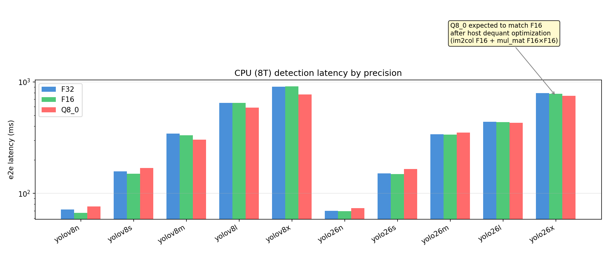
**Figure**: CPU (8T) detection latency by precision (before optimization). After the host dequant patch, Q8_0 latencies
are expected to converge toward the F16 row for each model since both paths share the same `im2col(F16) + mul_mat(F16,F16)`
compute pipeline — the only difference is the one-time dequant cost at session creation.
